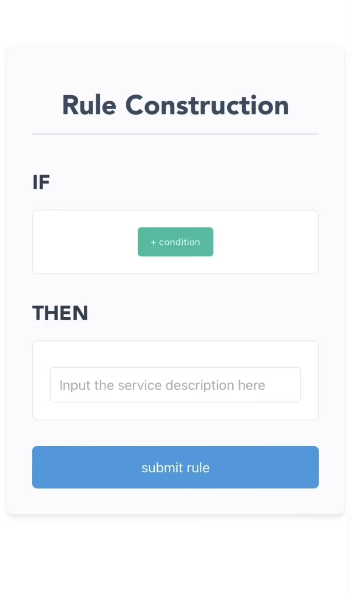

# Introduction

📦 This baseline system refers to existing automation tools (e.g., iOS Shortcuts) and supports users in constructing rules through screen clicks and text input. The system consists of three levels of interfaces:

1. **Home**: Displays rules in an IF-THEN format, allowing users to add, modify, or delete conditions and input service descriptions.
2. **Condition Selection**: Includes all condition types and examples, allowing users to choose from them.
3. **Condition Interface**: Supports users in entering related parameter information through various widgets such as checkboxes, sliders, built-in maps, and cameras.

The following video demonstrates an example where a rule is constructed: if the camera contains dumbbells and the location is within the student dormitory, then open the dumbbell tutorial in the Keep app.

**Click on the image below to watch the video:**

<a href="https://youtube.com/shorts/Ej6LI-nbkok?feature=share" target="_blank">
  
</a>

(Note: For privacy reasons, we randomly used the address of a student dormitory recommended by the map)

The system is built using the Vue-Flask framework, with the frontend utilizing the progressive framework [Vue](https://github.com/vuejs/vue), while the backend uses the micro framework [Flask](https://github.com/pallets/flask).


## Running Instructions
### 1. Install Dependencies
This project requires both Node.js and Python environments. If you're not familiar with setting up these environments, please refer to the reference articles at the end of this document.

> Version requirements: Node.js: 12+, Python: 3.6+

To install the dependencies, run the following commands:


    # Install frontend dependencies
    cd front
    npm install
    
    # Install backend dependencies
    cd back
    pip install -r requirements.txt

    
### 2. Start Frontend and Backend Services
   Open two terminal windows to run both the frontend and backend services.


    # Start frontend service
    cd front
    npm run dev -- --host
    
    # Start backend service
    cd back
    python app.py


### 3. Preview the Application

Open the following address in your browser:
```bash
https://localhost:8080/
```
to view and interact with the system.

## Project Structure

```
├── front/
│   ├── index.html
│   ├── key.pem
│   ├── csr.pem
│   ├── cert.pem
│   ├── vite.config.js
│   ├── package-lock.json
│   ├── package.json
│   ├── public/
│   │   └── favicon.ico
│   └── src/
│       ├── App.vue
│       ├── stores/
│       │   └── ruleStore.js
│       ├── utils/
│       │   ├── logger.js
│       │   └── deviceInfo.js
│       ├── main.js
│       ├── router.js
│       ├── map.js
│       ├── views/
│       │   ├── Questionnaire.vue
│       │   ├── ConditionSelection.vue
│       │   ├── Home.vue
│       │   ├── conditions/
│       │   │   ├── SpecificTime.vue
│       │   │   ├── App.vue
│       │   │   ├── Bluetooth.vue
│       │   │   ├── WiFi.vue
│       │   │   ├── Battery.vue
│       │   │   ├── TimeRange.vue
│       │   │   ├── UsageTime.vue
│       │   │   ├── Activity.vue
│       │   │   ├── Charger.vue
│       │   │   ├── Audio.vue
│       │   │   ├── Location.vue
│       │   │   ├── Screen.vue
│       │   │   ├── Message.vue
│       │   │   ├── Gesture.vue
│       │   │   ├── Camera.vue
│       │   │   ├── Text.vue
│       │   │   └── Voice.vue
│       │   └── ActionSelection.vue
│       ├── assets/
│       │   ├── video.MOV
│       │   └── logo.png
│       └── router/
│           └── index.js
├── back/
│   ├── requirements.txt
│   └── app.py
├── LICENSE
└── README.md

```
